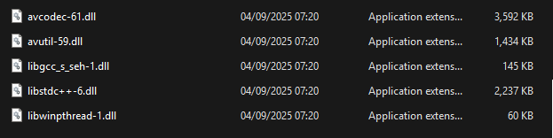

## Minimal FFMPEG 7.1.1 build script for GPU H264 encoding (windows x64)

Ffmpeg build script for cross-compiling ffmpeg for Windows from Arch Linux that disables everything except:
 - libopus
 - libx264
 - h264_nvenc
 - h264_amf
 - h264_qsv

Total size is ~7.2MB. Includes some required GCC dlls. Not sure why they are not statically compiled, a fix would be appreciated.

Takes ~5 minutes to build. Tested on Arch Linux on WSL. Specifically uses ffmpeg version 7.1.1 for compatibility with ffmpeg.autogen (C#)

### Output files:

